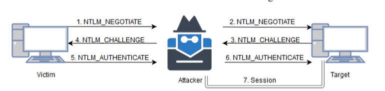
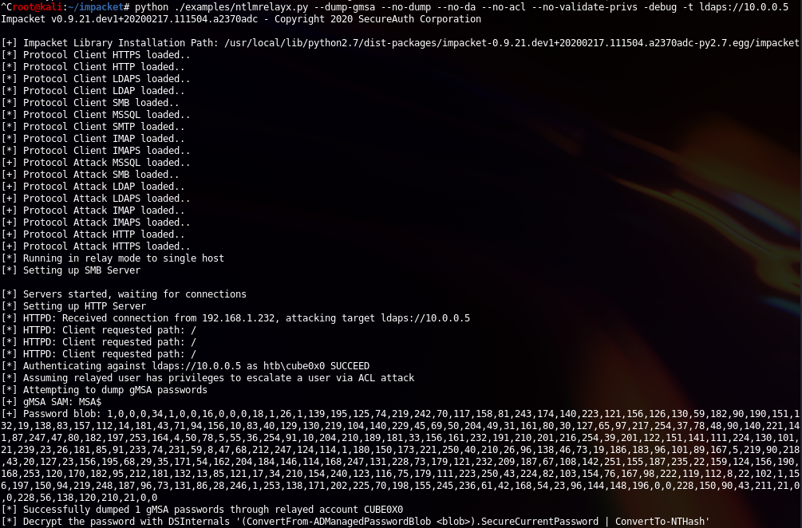
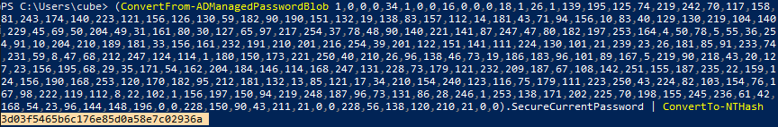

## Overview
gMSA is short for group managed service accounts in Active Directory. gMSA accounts have their passwords stored in a LDAP property called msDS-ManagedPassword which automatically get resets by the DC's every 30 days, are retrievable by authorized administrators and by the servers who they are installed on. 
msDS-ManagedPassword is an encrypted data blob called [MSDS-MANAGEDPASSWORD_BLOB](https://docs.microsoft.com/en-us/openspecs/windows_protocols/ms-adts/a9019740-3d73-46ef-a9ae-3ea8eb86ac2e) and it's only retrievable when the connection is secured, LDAPS or when the authentication type is 'Sealing & Secure' for an example.

I had little to no knowledge about what gMSA was before I watched the Bloodhound 3.0 webinar hosted by Wald0 and CptJesus which described why gMSA should be in focus during a penetration test.

So we know that there is often more users that are given authorized access to read gMSA passwords than there should, and that gMSA accounts often are given admin privileges and sometimes even Domain Admin. 

So how can we abuse this? How can we gather passwords for those often privileged accounts?

Since it's usally very easy to generate incoming NTLM authentications by various techniques and that the password is stored in a LDAP property, the best solution i could think of that causes the most damage possible was to integrate retrieval of the msDS-ManagedPassword LDAP property in ntlmrelayx. As you can review in my [Pull Request](https://github.com/SecureAuthCorp/impacket/pull/770).


## Relaying to LDAP
To accomplish a connection to LDAP through NTLM relaying we have to ensure that the relayed authentication is using the HTTP protocol. We can't relay SMB authentication because of the required signing bit. However, there was a vulnerability [CVE-2019-1040](https://portal.msrc.microsoft.com/en-US/security-guidance/advisory/CVE-2019-1040) that was making it possible to bypass the NTLM signing protection and by doing so it was possible to relay SMB -> LDAP.

The NTLM relaying process:
- 1\. The victim sends an NTLM_NEGOTIATE packet to the attacker.  
- 2\. The attacker than relays the NTLM_NEGOTIATE to the target server of their choice. 
- 3\. Target server answers back with an NTLM_CHALLENGE packet to the attacker. 
- 4\. Attacker relays the NTLM_CHALLANGE packet to the victim. 
- 5\. Victim answers with a NTLM_AUTHENTICATE back to the attacker.
- 6\. Attacker relays the NTLM_AUTHENTICATE to the target server. 
- 7\. The attacker now has an authenticated session with the target server.


Sadly, I had no luck in implementing 'Sealing & Secure' authentication in ntlmrelayx. For now, we have to relay to LDAPS which is just LDAP over ssl which dosen't exists on a default AD installation because there is no default available certificate.


## Configuring gMSA
```
# Create a KDS Root Key on DC
Add-KdsRootKey -EffectiveTime (Get-Date).AddHours(-10)
 
# Create a new gMSA on DC
New-ADServiceAccount -Name svc_msa -DNSHostName dc.htb.local -ManagedPasswordIntervalInDays 30 -PrincipalsAllowedToRetrieveManagedPassword msa_read,dc$

#Install gMSA on the target server
Install-WindowsFeature AD-DOMAIN-SERVICES
Install-AdServiceAccount svc_msa 
```


## Exploitation
To get started we must first generate NTLM authentication requests that we can relay, we can do that in a few different ways, for example
- ADIDNS wildcard record
- Responder 
- WPAD + Mitm6 
- Exploiting a vuln service to create a HTTP auth request (Webdav redirector installed? Use the SMB protocol)

Clone my repo, install impacket, start ntlmrelayx and pick your technique to generate NTLM authentication traffic (This aint a post about exploiting services nor network poisoning so i won't go into details about it)
```
git clone https://github.com/cube0x0/impacket
cd impacket
python setup.py install
python ./examples/ntlmrelayx.py --dump-gmsa --no-dump --no-da --no-acl --no-validate-privs -debug -t ldaps://10.0.0.5
```

Convert the blob using the DSInternals module. The password is stored in  random unicode letters so we have to covert the plaintext password into RC4 format
```
(ConvertFrom-ADManagedPasswordBlob <blob>).SecureCurrentPassword | ConvertTo-NTHash
```


### Update 
Due to awesome work from [@asolino](https://github.com/asolino), we now have a full implementation of the the MSDS-MANAGEDPASSWORD_BLOB structure using the impacket.structure module. This makes it possible to parse the datablob and convert the password in real time so DSinternal is no longer required, Impacket will give you the NT password directly from the output

## Mitigations
NTLM relaying to LDAP and LDAPS can be mitigated by enabling LDAP signing and LDAP channel binding. 
Permissions and group membership for service accounts can be identified by BloodHound and every organisation should have the goal to follow the least privileged model.


## Links
- [https://www.secureauth.com/blog/playing-relayed-credentials](https://www.secureauth.com/blog/playing-relayed-credentials)
- [https://docs.google.com/presentation/d/1vZ1QckmtjpBsOff85IaP1mt4fEDmWYW3ziAHVHiLd5I/edit#slide=id.g7ddaaf9066_0_66](https://docs.google.com/presentation/d/1vZ1QckmtjpBsOff85IaP1mt4fEDmWYW3ziAHVHiLd5I/edit#slide=id.g7ddaaf9066_0_66) - BH Webinar
- [https://github.com/SecureAuthCorp/impacket/pull/770](https://github.com/SecureAuthCorp/impacket/pull/770) - PR
- [https://www.dsinternals.com/en/retrieving-cleartext-gmsa-passwords-from-active-directory/](https://www.dsinternals.com/en/retrieving-cleartext-gmsa-passwords-from-active-directory/) - DSInternals
