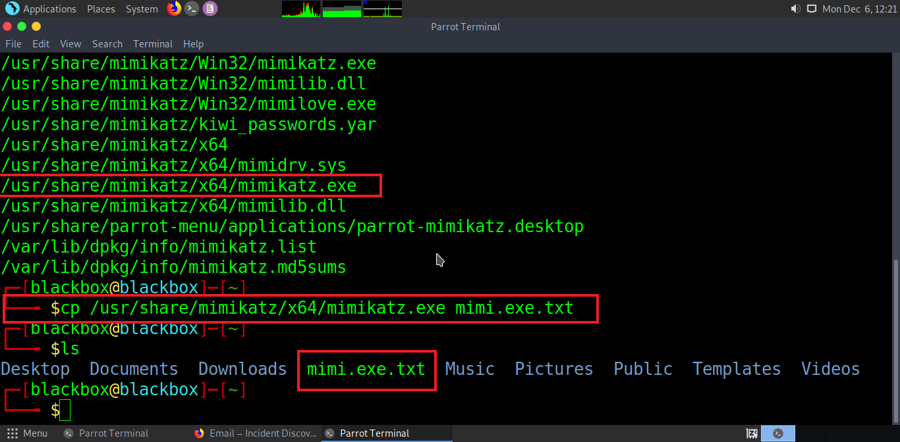
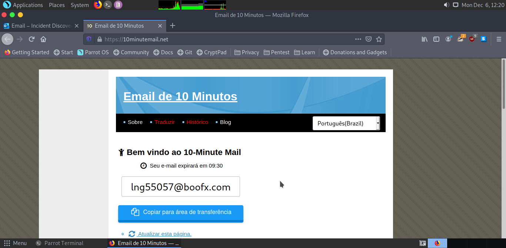
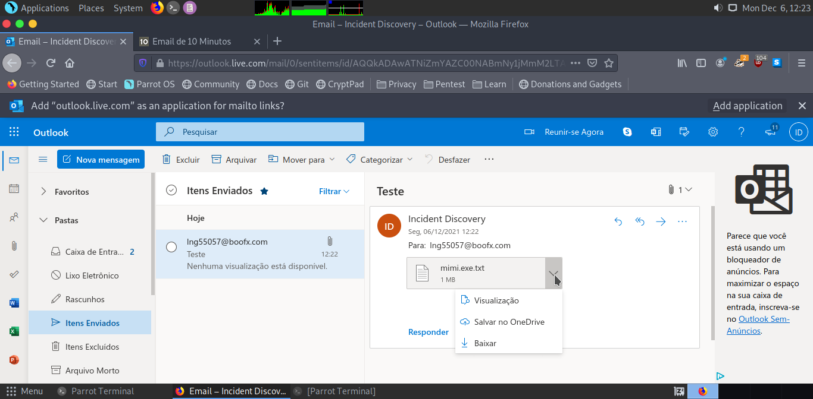
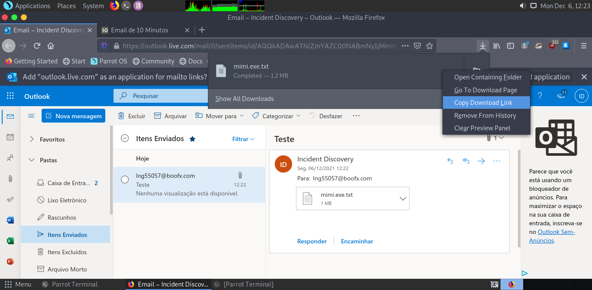
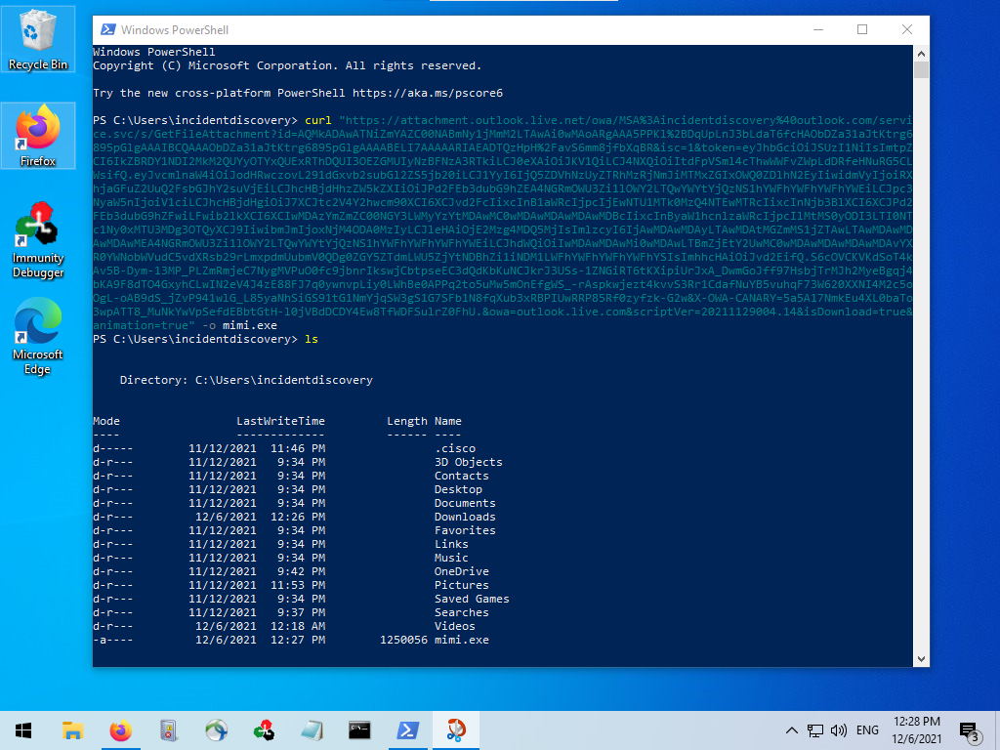

## Descrição
Conseguimos através do anexo de e-mail do Outlook armazenar arquivos maliciosos nos permitindo realizar o upload/download de arquivos maliciosos através de um “local confiável” por se tratar de um subdomínio do Outlook.

## Passos para reproduzir
Primeiramente devemos modificar o arquivo malicioso adicionando uma extensão de texto (.txt)
No Linux podemos incluir essa extensão de várias formas, uma delas é utilizar o comando **cp** para cria uma cópia do arquivo adicionando a extensão de texto, nesse caso ficaria algo como: **arquivo.exe.txt**

Após prepararmos o arquivo malicioso podemos enviar um e-mail anexando nosso arquivo modificado para qualquer destino (*nesse exemplo estamos encaminhando para um endereço de e-mail temporário*) pois o que nos interessa é o link direto do arquivo.

Depois de enviarmos vamos em **Itens Enviados** e baixar o arquivo em anexo para obter o link direto do arquivo, para isso vamos em **Downloads do Navegador > Botão Direito >  Copiar link.**

Com o "link direto" podemos realizar o download através do PowerShell do Windows utilizando o comando **Curl** e a opção **-o** de output para criar a saida do arquivo com a extensão original (*um executável*) então o comando seria: `curl "link_do_arquivo.com.br" -o mimi.exe`

## Prova de Conceito (PoC)

## Observações
* Não recomendamos realizar o upload de arquivos executáveis (.exe) pois o outlook detecta como arquivo malicioso e impede que o download seja realizado.
* Arquivos muito grandes também são bloqueados por conta da restrição de tamanho por parte do anexo.
* Um outro ponto interessante é que o arquivo após enviado tem um prazo de validade que vária entre 10 à 15 minutos

## Cénario de Ataque
Esse tipo de técnica é útil em ambientes internos (externos também) onde geralmente existem bloqueios em determinadas origens, e por se tratar de um “domínio confiável” podemos realizar o download de forma segura.
